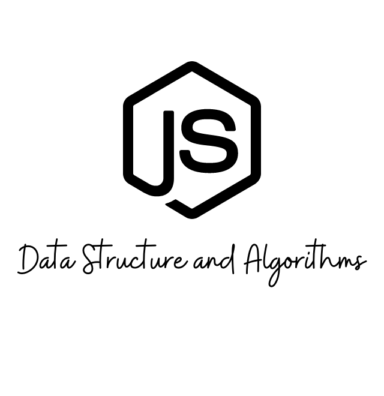

<h5 align="center">


While HTML and CSS control the content and styling of a page, JavaScript is used to make it interactive. In the JavaScript Algorithm and Data Structures Certification, I'll learn the fundamentals of JavaScript including variables, arrays, objects, loops, and functions. <br>

Once I have the fundamentals down, I'll apply that knowledge by creating algorithms to manipulate strings, factorialize numbers, and even calculate the orbit of the International Space Station.<br>

Along the way, I'll also learn two important programming styles or paradigms: Object Oriented Programming (OOP) and Functional Programming (FP).<br>

```
Note: Some browser extensions, such as ad-blockers and script-blockers can interfere with the tests. If you face issues, we recommend disabling extensions that modify or block the content of pages while taking the course.
```
</h1>

### Basic JavaScripts  0️⃣1️⃣

JavaScript is a scripting language you can use to make web pages interactive. It is one of the core technologies of the web, along with HTML and CSS, and is supported by all modern browsers.

👉 [Basic JavaScripts Codes](https://github.com/ruhulaminparvez/FreeCodeCamp-Container/tree/main/002_JavaScript%20Algorithms-and-Data-Structures/01_Basic-JavaScript)


### ES6  0️⃣2️⃣

ECMAScript, or ES, is a standardized version of JavaScript. Because all major browsers follow this specification, the terms ECMAScript and JavaScript are interchangeable.

Most of the JavaScript you've learned up to this point was in ES5 (ECMAScript 5), which was finalized in 2009. While you can still write programs in ES5, JavaScript is constantly evolving, and new features are released every year.

ES6, released in 2015, added many powerful new features to the language. In this course, you'll learn these new features, including arrow functions, destructuring, classes, promises, and modules.

👉 [ES6 Codes](https://github.com/ruhulaminparvez/FreeCodeCamp-Container/tree/main/002_JavaScript%20Algorithms-and-Data-Structures/02_ES6)


### Regular Expressions  0️⃣3️⃣

Regular expressions, often shortened to "regex" or "regexp", are patterns that help programmers match, search, and replace text. Regular expressions are very powerful, but can be hard to read because they use special characters to make more complex, flexible matches.

👉 [Regular Expressions Codes](https://github.com/ruhulaminparvez/FreeCodeCamp-Container/tree/main/002_JavaScript%20Algorithms-and-Data-Structures/03_Regular-Expressions)


### Debugging  0️⃣4️⃣

Debugging is the process of going through your code, finding any issues, and fixing them.

Issues in code generally come in three forms: syntax errors that prevent your program from running, runtime errors where your code has unexpected behavior, or logical errors where your code doesn't do what you intended.

👉 [Debugging Codes](https://github.com/ruhulaminparvez/FreeCodeCamp-Container/tree/main/002_JavaScript%20Algorithms-and-Data-Structures/04_Debugging)


### Basic Data Structures 0️⃣5️⃣

Data can be stored and accessed in many ways. We already know some common JavaScript data structures — arrays and objects. We'll also learn how to use helpful JS methods like splice() and Object.keys() to access and manipulate data.

👉 [Basic Data Structures Codes](https://github.com/ruhulaminparvez/FreeCodeCamp-Container/tree/main/002_JavaScript%20Algorithms-and-Data-Structures/05_Basic-Data-Structures)


### Basic Algorithm Scripting 0️⃣5️⃣

An algorithm is a series of step-by-step instructions that describe how to do something.

To write an effective algorithm, it helps to break a problem down into smaller parts and think carefully about how to solve each part with code.

👉 [Basic Algorithm Scripting Codes](https://github.com/ruhulaminparvez/FreeCodeCamp-Container/tree/main/002_JavaScript%20Algorithms-and-Data-Structures/05_Basic-Algorithm-Scripting)
