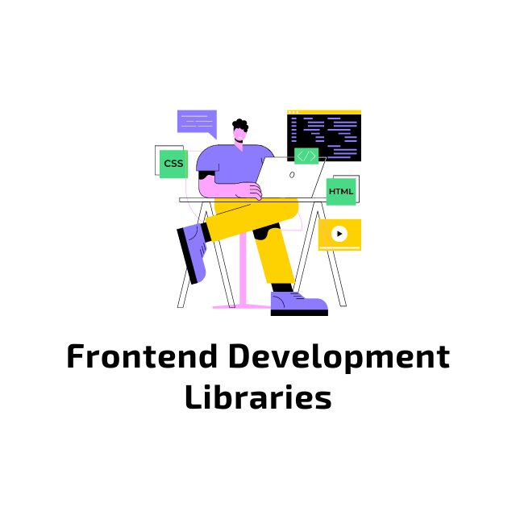

<h1 align="center">

</h1>

### Bootstrap 0️⃣1️⃣

Bootstrap is a front end framework used to design responsive web pages and applications. It takes a mobile-first approach to web development, and includes pre-built CSS styles and classes, plus some JavaScript functionality.

👉 [Bootstrap Codes](01_Bootstrap)